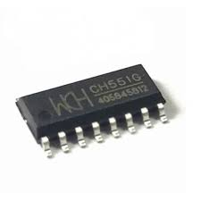
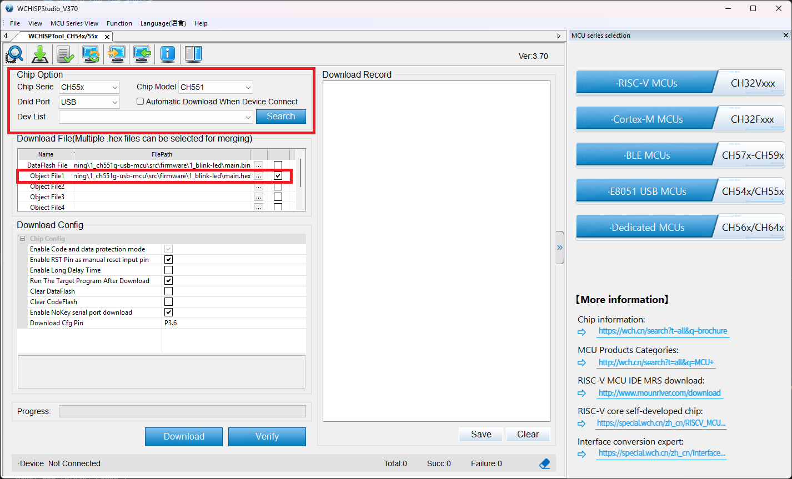

# About this repository
We have learned the USB MCU CH551G for educational purpose. All our documents, notes and source during the process will be stored here.

# About CH551 USB MCU
This MCU is 8-bit MCU with **built-in** USB device controller from https://www.wch.cn/. It's very cheap (**only 7.000VND - 0.31$**) but we can **directly** download the program by USB interface (*external debugger/programmer is not necessory*).



# How to use this repository
## Structure
```
+---docs
+---ref
|   \---USB_Relay_HID
\---src
    +---firmware
    \---hardware
```
1. ```docs```: contains the datasheet, notes,...
2. ```ref```: contains the reference documents and repo.
3. ```source```: 
   
   3.1. ```firmware```: contains the programs, examples, libraries,...
  
   3.2. ```hardware```: contains the schematics, PCBs of development kits and application boards.
## How to run the source
### Prerequisition
- Install [sdcc compiler](https://sourceforge.net/projects/sdcc/files/) and <a href="https://gnuwin32.sourceforge.net/packages/make.htm" target="_blank">Makefile</a>.
- Install [WCHISPTool](https://www.wch-ic.com/downloads/WCHISPTool_Setup_exe.html) for programs downloading.
### Compile the program
- Use following command for compile the program
```shell
sdcc -c main.c
sdcc main.rel
packihx main.rel > main.hex
```
- Or you can create the Makefile for automating it. All output files are in the ```output``` directory.
```make
# Define output directory
OUTPUT_DIR = output

# Compile each .c file into .rel files
hex: main.rel
	sdcc $(OUTPUT_DIR)\main.rel -o $(OUTPUT_DIR)\main.ihx

# Compile main.c to main.rel
$main.rel: main.c
	mkdir $(OUTPUT_DIR)
	sdcc -c main.c -o $(OUTPUT_DIR)\main.rel

all: hex
	packihx $(OUTPUT_DIR)\main.ihx > $(OUTPUT_DIR)\main.hex

clean:
	rmdir /s /q $(OUTPUT_DIR)
```
### Program the chip

**Note:** *To program the chip:* Keep D+ pin of MCU in high level before suppling the power of MCU. It makes CH551G entering the programming mode.
# Contributors
1. Giang Phan Truong
2. Khoa Dong Thanh
3. Tuan Pham Ho Anh